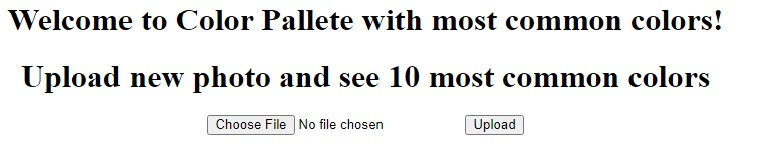
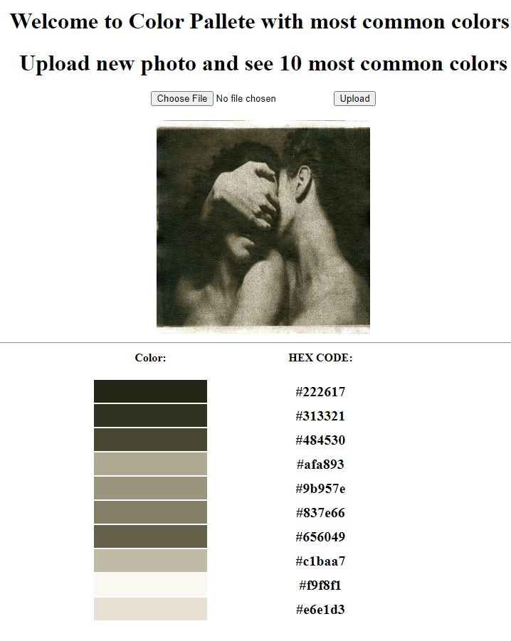

# Image Colour Palette Generator , Python

* This project handle Image Processing and Data Science part with Back-End of Flask. I've added file form to choose
  image to upload and then process through tools to extract 10 most commong colours in that photo.

* Website that gave me some inspiration:

  [Color Extract Example](http://www.coolphptools.com/color_extract#demo)

### Requirements

##### OS Module:

[os docs](https://docs.python.org/3/library/os.html)

##### Flask App:

[Flask docs](https://flask.palletsprojects.com/en/2.2.x/)

##### Werkzeug utils Python Module:

[Werkzeug docs](https://werkzeug.palletsprojects.com/en/2.2.x/installation/#python-version)

##### SciPy software Python:

[SciPy docs](https://docs.scipy.org/doc/scipy/)

##### SKLearn ML Library:

[SKLearn docs](https://scikit-learn.org/stable/)

##### Numpy:

[Numpy docs](https://numpy.org/doc/)

##### Pillow Python Imaging Library:

[Pillow docs](https://pillow.readthedocs.io/en/stable/)

##### Binascii Module:

[Binascii docs](https://docs.python.org/3/library/binascii.html)

### Usage

* Firstly we must open file image file and press upload after we choose particular image, 
  that can process and extract 10 colors below.
  
  
  
* Below down we have color sample and next to sample there is a hex code for that color.

  

* Ideas of this project is to help curious developers or designers who work on some project and interested about
HEX code to use it color into project they're working to(CSS mostly).

    
### Ideas for future improvements

##### This project as any other have always space for improvements.
    I use a lot ideas to practice and upgrade my skills.
    
* Improve User Interface, User Experience.
* Advanced CSS styling or using Bootstrap easy use templates.
* More information about color, etc. how many pixels we got with particular color, or color transformation and lot 
  mighty things that I learned in Numpy and other Data Science Tools.
  
* First versions always have its own core with possibility for advanced upgrade and other things.
